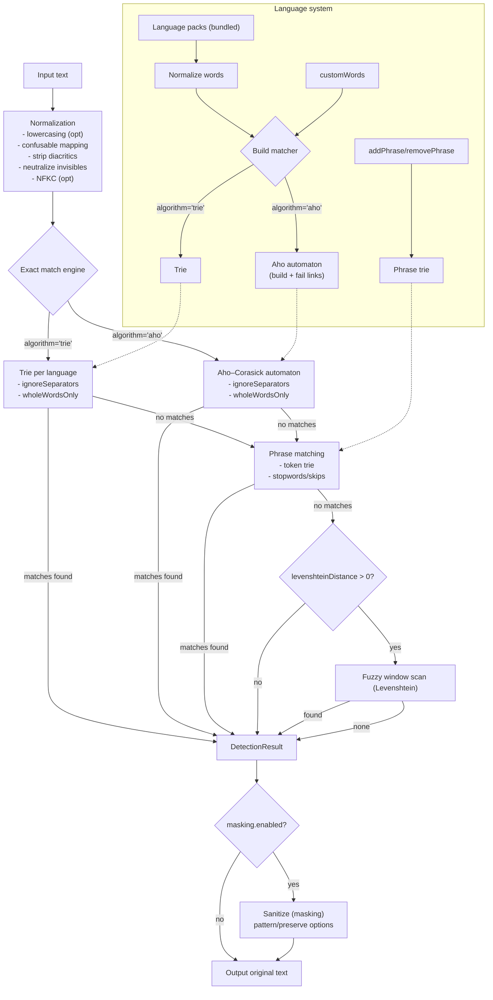

# ProfanityBuster

A high-performance, cross-platform profanity detection and filtering library built for JavaScript/TypeScript applications. Designed with a custom hybrid tree algorithm for optimal performance and modular language packs for efficient bundle management.

## 🚀 Overview

ProfanityBuster provides a unified API for detecting, filtering, and sanitizing profane or harmful language in user-generated content. Built specifically for modern web development with seamless integration for Next.js, React, and other JavaScript frameworks.

## 📦 Installation

```bash
npm install profanitybuster
# or
yarn add profanitybuster
# or
pnpm add profanitybuster
```

## ⚡ Quick Start

ESM:

```ts
import ProfanityBuster from 'profanitybuster';

const buster = new ProfanityBuster({
  languages: { enabled: ['en'], autoDetect: false, fallback: 'en' },
});
const has = buster.detect('sh1t happens').hasProfanity; // true (confusables handled)
const clean = buster.sanitize('s*h-i t'); // length-preserving masking
```

CommonJS:

```js
const { ProfanityBuster } = require('profanitybuster');
const buster = new ProfanityBuster({
  languages: { enabled: ['en'], autoDetect: false, fallback: 'en' },
});
console.log(buster.detect('sh1t').hasProfanity);
```

## ✨ Key Features

### Core Functionality

- **Binary Profanity Detection**: Simple true/false detection of profane content
- **Configurable Masking**: Transform profanity with customizable masking patterns (e.g., `f**k`)
- **Exact Matching (Trie/Aho–Corasick)**: Per-language Trie or Aho–Corasick automaton for exact matching
- **Variant Detection (optional)**: Levenshtein distance fallback to catch variations and misspellings
- **Multi-language Support**: 20+ languages with modular language packs
- **Confusable Normalization**: Optional mapping of common look-alikes (e.g., `1→i`, `0→o`, `@→a`)

### Performance & Architecture

- **Hybrid Tree Matching**: Trie-driven multi-pattern matching with optional fuzzy fallback
- **Modular Language Packs**: Enable languages on-demand; packs are bundled in this build
- **Cross-platform Compatible**: Works in Node.js server environments and web browsers
- **TypeScript Support**: Full type definitions included

### Framework Integration

- **Next.js/SSR-friendly**: Works in Node.js and browsers; core has no Node-only APIs
- **React Hook**: `useProfanityBuster` for client usage
- **Express Middleware**: `createProfanityMiddleware` for server-side sanitization
- **Universal NPM Package**: Single package for both server-side and client-side use

#### React Hook

```tsx
import { integrations } from 'profanitybuster';

const { useProfanityBuster } = integrations;

function CommentBox() {
  const { buster, ready, sanitize } = useProfanityBuster({
    preloadLanguages: ['en'],
  });
  if (!ready) return null;
  return <textarea onChange={(e) => (e.currentTarget.value = sanitize(e.currentTarget.value))} />;
}
```

React (TypeScript)

```tsx
'use client';
import { useState } from 'react';
import ProfanityBuster, {
  lowLatencyPreset,
  type ProfanityBusterConfig,
  integrations,
} from 'profanitybuster';

const { useProfanityBuster } = integrations;

export function CommentBoxTS() {
  const [value, setValue] = useState('');
  const config: Partial<ProfanityBusterConfig> = {
    ...lowLatencyPreset,
    languages: { enabled: ['en'], autoDetect: false, fallback: 'en' },
  };

  const { ready, detect, sanitize } = useProfanityBuster({
    config,
    preloadLanguages: ['en', 'fr'],
  });

  if (!ready) return null;
  const hasProfanity = detect(value).hasProfanity;
  return (
    <div>
      <textarea value={value} onChange={(e) => setValue(e.currentTarget.value)} />
      {hasProfanity && <small>Profanity detected</small>}
      <button onClick={() => setValue((v) => sanitize(v))}>Sanitize</button>
    </div>
  );
}
```

#### Express Middleware

```ts
import express from 'express';
import { integrations } from 'profanitybuster';

const app = express();
app.use(express.json());
app.use(
  integrations.createProfanityMiddleware({
    preloadLanguages: ['en'],
    sanitizeFields: ['body.comment'],
  }),
);
```

Notes:

- `sanitizeFields` is a dot-separated path that must contain only letters, numbers, underscores, and dots. Suspicious keys like `__proto__` are ignored for safety.

Node/SSR (TypeScript)

```ts
import ProfanityBuster, { type ProfanityBusterConfig, lowLatencyPreset } from 'profanitybuster';

const config: Partial<ProfanityBusterConfig> = {
  ...lowLatencyPreset,
  languages: { enabled: ['en'], autoDetect: false, fallback: 'en' },
};

const buster = new ProfanityBuster(config);
await buster.loadLanguages(['es']);

const result = buster.detect('esto es una mierda');
if (result.hasProfanity) {
  console.log(result.matches);
}
```

## 🏗️ Architecture Design

### Hybrid Matching

The library combines multiple matchers for performance and flexibility:

- **Aho–Corasick automaton (default in low-latency preset)**: linear-time O(n + matches) multi-pattern exact matching
- **Trie (prefix tree)**: baseline per-language exact matcher
- **Phrase trie (token-based)**: optional phrase detection with stopword skips
- Future: Radix-tree optimizations (not implemented yet)

### Modular Language System

```text
profanitybuster/
├── src/
│   ├── core/
│   │   ├── aho.ts
│   │   ├── trie.ts
│   │   ├── phraseTrie.ts
│   │   ├── normalization.ts
│   │   └── langAutoDetect.ts
│   ├── integrations/
│   │   ├── express/
│   │   │   └── middleware.ts
│   │   └── react/
│   │       └── useProfanityBuster.ts
│   ├── languages/
│   │   ├── ar.ts ... zh.ts
│   │   └── index.ts
│   ├── presets.ts
│   └── index.ts            # Public API
├── tests
│   ├── basic.test.ts
│   └── languages-load.test.ts
├── bench/
│   ├── algorithm.bench.ts
│   ├── detect.bench.ts
│   ├── largeWordlist.bench.ts
│   └── perf.bench.ts
├── scripts/
│   └── import-dirtywords.mjs
├── vitest.config.mts
├── tsconfig.json
├── package.json
└── README.md
```

### API Structure

```javascript
// Basic usage
import ProfanityBuster from 'profanitybuster';

const filter = new ProfanityBuster({
  languages: ['en'],
  masking: {
    enabled: true,
    pattern: '*',
  },
  detection: {
    levenshteinDistance: 1,
    caseSensitive: false,
    wholeWordsOnly: false,
    confusableMapping: true,
  },
});

// Detection
const hasProfanity = filter.detect(text);

// Sanitization
const cleanText = filter.sanitize(text);
```

### API Reference (core)

```ts
new ProfanityBuster(config?: Partial<ProfanityBusterConfig>)

// detection
detect(text: string): { hasProfanity: boolean; matches: Array<{ word: string; index: number; length: number; language: string }> }
sanitize(text: string): string

// language management
loadLanguages(codes: string[]): Promise<void>        // enable packs and (re)build matchers
setLanguages(enabled: string[], fallback?: string): void
addWord(word: string, language?: string): void
removeWord(word: string, language?: string): void
setAlgorithm(algo: 'trie' | 'aho'): void             // switch exact-matching engine

// phrase management
addPhrase(phrase: string): void
removePhrase(phrase: string): void
```

## 🎯 Technical Requirements

### Detection Algorithm

- **Exact Matching Engine**: Select via `detection.algorithm: 'aho' | 'trie'` (Aho–Corasick recommended)
- **Levenshtein Distance**: Optional fallback for variants (disable for max speed)
- **Pattern Matching**: Handles common obfuscation techniques via normalization
- **Performance Target**: Sub-millisecond detection for typical content

### Language Support

Bundled language codes:

- ar (Arabic)
- cs (Czech)
- da (Danish)
- de (German)
- en (English)
- eo (Esperanto)
- es (Spanish)
- fa (Persian)
- fi (Finnish)
- fr (French)
- hi (Hindi)
- hu (Hungarian)
- it (Italian)
- ja (Japanese)
- ko (Korean)
- nl (Dutch)
- no (Norwegian)
- pl (Polish)
- pt (Portuguese)
- ru (Russian)
- sv (Swedish)
- th (Thai)
- tlh (Klingon)
- tr (Turkish)
- zh (Chinese)

### Bundle Optimization

- Core library + language packs bundled together in this repo
- Enable/disable packs at runtime via `loadLanguages([...])` and `setLanguages(...)`
- To ship fewer packs, trim `src/languages/index.ts` before building
- Tree-shaking applies to unused code paths but not to the statically imported word arrays unless removed

## 🔧 Configuration Options

### Masking Configuration

```javascript
{
  masking: {
    enabled: true,
    pattern: '*',           // Character to use for masking
    preserveLength: true,   // Keep original word length
    preserveFirst: true,    // Keep first character visible
    preserveLast: false     // Keep last character visible
  }
}
```

### Detection Settings

```javascript
{
  detection: {
    levenshteinDistance: 2,    // Tolerance for variants
    caseSensitive: false,      // Case sensitivity
    wholeWordsOnly: false,     // Match whole words vs substrings
    customWords: [],           // Additional words to detect
    confusableMapping: true,   // Map common look-alikes (1->i, 0->o, @->a, etc.)
    ignoreSeparators: [' ', '.', '-', '_', '*'], // Skip common separators in matches
    stripDiacritics: true,     // Remove combining accents in a length-preserving manner
    useNFKC: false,            // Full NFKC normalization (set true if you can accept non-length-preserving)
    enableInflections: true,   // Generate simple inflection variants (suffixes)
    inflectionSuffixes: ['s', 'es', 'ed', 'ing', 'er', 'ers'],
    allowlist: [],             // Terms to ignore even if matched
    tokenBoundedFuzzy: true,   // Fuzzy checks start at token boundaries
    phraseStopwords: ['of', 'the', 'a', 'an', 'and', 'to'], // Allowed between phrase tokens
    phraseMaxSkips: 2,         // How many stopwords/separators allowed between tokens
    algorithm: 'trie'          // 'trie' | 'aho'
  }
}
```

### Language Management

```javascript
{
  languages: {
    enabled: ['en', 'es'],     // Active language packs to preload
    autoDetect: false,         // Automatic language detection (see notes below)
    fallback: 'en'             // Default language pack
  }
}
```

#### Dynamic Language Loading

Load languages on demand to keep bundles small:

```ts
const filter = new ProfanityBuster({ languages: ['en'] });
await filter.loadLanguages(['es', 'fr']);
```

Note: Language packs are bundled statically in this package. `loadLanguages([...])` enables and (re)builds matchers for packs that are already included; it does not fetch over the network. To ship fewer packs, trim `src/languages/index.ts` before building or publish a fork with a reduced set.

#### Auto-detect Modes

- If `autoDetect: true` and you have preloaded some languages (via `loadLanguages([...])`), detection will prefer those whose script matches the input. This narrows scans and keeps latency low.
- If `autoDetect: true` and you have not preloaded any languages, the library will load and scan all known built-in language packs as a fallback. This is slower but maximizes coverage.
- For CJK languages, consider `wholeWordsOnly: false` to match within tokens.

### Presets

```ts
import ProfanityBuster, { lowLatencyPreset, highRecallPreset } from 'profanitybuster';

const lowLatency = new ProfanityBuster({
  ...lowLatencyPreset,
  languages: { enabled: ['en'], autoDetect: false, fallback: 'en' },
});

const highRecall = new ProfanityBuster({
  ...highRecallPreset,
  languages: { enabled: ['en', 'fr'], autoDetect: false, fallback: 'en' },
});
```

## 📦 Deployment Strategy

### NPM Package Structure

- **Main package**: core library with TypeScript definitions and bundled language packs
- **Integrations**: React hook and Express middleware
- **Benchmarks and tests** included

### Build Targets

- **CommonJS**: Node.js server environments
- **ES Modules**: Modern bundlers and browsers
- **TypeScript**: Full type definitions

Build toolchain: `tsup` (bundles CJS+ESM with type declarations). Tests via `vitest`.

## 🏷️ Versioning & CI releases

Releases are driven by Git tags. The CI workflow publishes to npm on pushes of tags that start with `v`.

- **Trigger**: pushing a tag that matches `v*.*.*` (e.g., `v1.2.3`, `v1.2.3-alpha.1`).
- **What CI does**: typecheck, lint, test, build, then `npm publish --provenance --access public`.

### How to cut a release

1) Bump the version in `package.json` and create a matching tag (recommended via npm):

```bash
# from the repo root on main
npm version patch    # or: minor | major
# or pre-releases:
# npm version prerelease --preid alpha   # -> 1.2.3-alpha.0
# npm version preminor --preid rc        # -> 1.3.0-rc.0

# pushes commit and tag created by npm version (e.g., v1.2.3)
git push origin main --follow-tags
```

2) CI will run and, if the tag starts with `v`, publish the exact version in `package.json` to npm.

### Git-only commands (manual tagging)

If you prefer to create tags yourself (without `npm version`):

```bash
# 1) Commit your changes with the final version in package.json
git add -A
git commit -m "chore(release): v1.2.3"

# 2) Create an annotated tag (recommended)
git tag -a v1.2.3 -m "release: v1.2.3"

# 3) Push branch and tag
git push origin main
git push origin v1.2.3

# Pre-release example
git tag -a v1.2.4-alpha.1 -m "release: v1.2.4-alpha.1"
git push origin v1.2.4-alpha.1
```

### Fix a wrong tag

Pushed the wrong tag? Delete it locally and remotely, then re-tag and push again:

```bash
# delete local tag
git tag -d v1.2.3
# delete remote tag
git push origin :refs/tags/v1.2.3

# update package.json if needed, commit, then re-tag
git tag -a v1.2.3 -m "release: v1.2.3"
git push origin v1.2.3
```

### Tag/Version rules

- **Tag format**: `vMAJOR.MINOR.PATCH` with optional pre-release, e.g., `v1.2.3-alpha.1`.
- **Keep in sync**: the tag version should match `package.json` version exactly (minus the leading `v` in the tag).
- **Conventional commits**: this repo uses commitlint; commit messages should follow Conventional Commits.

### Pre-releases and npm dist-tags

By default, the workflow publishes without a custom dist-tag. If you want pre-releases to avoid becoming `latest`, publish them with a non-latest tag (e.g., `next`). You can do this manually or adapt the workflow:

```bash
# manual publish example (if not using CI):
npm publish --tag next --provenance --access public
```

If you routinely publish pre-releases, consider changing the CI `npm publish` step to include `--tag next` when the version contains a pre-release identifier.

## ⚙️ Technical Implementation (fast, light, accurate)

### Pipeline

1. Normalization
   - Lowercasing (unless `caseSensitive: true`)
   - Optional confusable mapping (`confusableMapping: true`): `1→i`, `0→o`, `3→e`, `@→a`, `$→s`, etc.
   - Neutralize zero-width/invisible characters (replaced with spaces in length-preserving mode)
2. Exact matching (hot path)
   - Per-language Trie or Aho–Corasick automaton from normalized wordlists and `customWords`
   - Respects `wholeWordsOnly` and `ignoreSeparators`
3. Phrase matching (optional)
   - Tokenized phrase trie with `phraseStopwords` and `phraseMaxSkips` using precise token start/end offsets
4. Fuzzy fallback (optional)
   - Only if `levenshteinDistance > 0`
   - Sliding window minimal distance check; early exit on first match



### Data Structures

- `Set<string>` per language for storage
- `Trie` or `AhoCorasick` per language for exact matching
- `PhraseTrie` for token-level phrases
- Matchers rebuild when languages/custom words/phrases change

### Complexity

- Exact matching (Aho–Corasick): O(n + matches)
- Exact matching (Trie baseline): O(n · avgMatchDepth) worst case
- Phrase matching: proportional to token count with allowed skips
- Fuzzy fallback: O(n · m) worst-case for word length m; disable via `levenshteinDistance: 0`

### Accuracy Controls

- `wholeWordsOnly`: avoid substring matches inside larger tokens
- `confusableMapping`: defeat simple obfuscations like leet-speak
- `levenshteinDistance`: tolerance for misspellings (0 for maximum precision)
- `caseSensitive`: language-specific needs; keep false for best coverage

### Performance Tuning Recipes

- Low-latency preset (recommended)

```ts
const filter = new ProfanityBuster({
  detection: {
    levenshteinDistance: 0,
    caseSensitive: false,
    wholeWordsOnly: true,
    confusableMapping: true,
    algorithm: 'aho',
  },
});
```

- High-recall moderation preset

```ts
const filter = new ProfanityBuster({
  detection: {
    levenshteinDistance: 1,
    caseSensitive: false,
    wholeWordsOnly: false,
    confusableMapping: true,
    algorithm: 'aho',
  },
});
```

### Notes on Safety & Footprint

- No heavy regex in hot path (Trie/Aho-based). Helpers use explicit Unicode boundary checks (no regex lookbehind).
- ESM + CJS outputs with small core; language packs are modular.
- Default config is frozen internally to avoid accidental mutation between instances.

## 🧪 Production setup (recommended)

Use the low-latency profile with Aho–Corasick, whole-words, minimal separators, and no fuzzy/inflections. Preload only needed languages and avoid mutating wordlists at runtime.

```ts
import ProfanityBuster, { lowLatencyPreset, type ProfanityBusterConfig } from 'profanitybuster';

const config: Partial<ProfanityBusterConfig> = {
  ...lowLatencyPreset, // algorithm: 'aho', levenshteinDistance: 0, inflections disabled
  languages: { enabled: ['en'], autoDetect: false, fallback: 'en' },
  detection: {
    ...lowLatencyPreset.detection,
    wholeWordsOnly: true,
    ignoreSeparators: [' ', '.', '-', '_'],
    confusableMapping: true,
  },
};

export const buster = new ProfanityBuster(config);
// optionally preload other packs
// await buster.loadLanguages(['es']);
```

Notes:

- Whole-word boundaries reduce false positives.
- Confusable mapping defeats simple obfuscations.
- Keep separators minimal; each extra char adds preprocessing work.
- Keep the instance read-only during traffic; rebuild only at startup.

## 🧪 Performance

Sample benchmarks on a modern Mac (numbers vary by hardware):

```text
detect small  ~0.23 ms/op   (~4.33k ops/s)
detect medium ~1.71 ms/op   (~585 ops/s)
detect large  ~8.22 ms/op   (~122 ops/s)
```

Run locally:

```bash
npm run bench    # micro bench via vitest
npm run perf     # alias of the above
```

### Aho–Corasick vs Trie (MacBook M3 Pro)

```text
aho small    ~0.144 ms/op   (~6.94k ops/s)
trie small   ~0.146 ms/op   (~6.85k ops/s)
aho medium   ~1.503 ms/op   (~665 ops/s)
trie medium  ~1.459 ms/op   (~685 ops/s)
aho large    ~7.50  ms/op   (~133 ops/s)
trie large   ~7.14  ms/op   (~140 ops/s)
```

Notes:

- In this run: small favored Aho; medium/large favored Trie. Both are generally comparable on small/medium inputs.
- Very large dictionaries tend to favor Aho–Corasick. For big wordlists (e.g., 10k–100k), consider `algorithm: 'aho'`, disable inflections, and keep fuzzy off.

### Large wordlist scaling (synthetic)

Medium text (~10–20KB), custom dictionary size:

```text
aho dict10k medium    ~1.51 ms/op  (~663 ops/s)
trie dict10k medium   ~1.72 ms/op  (~583 ops/s)
aho dict100k medium   ~1.54 ms/op  (~648 ops/s)
trie dict100k medium  ~1.72 ms/op  (~582 ops/s)
```

Interpretation:

- With larger dictionaries (10k–100k), Aho–Corasick tends to edge out Trie in this setup.
- Memory grows with total characters and data structure overhead; prefer `enableInflections: false` and `levenshteinDistance: 0` for large lists.

## 🌐 Browser/SSR Notes

- Works in Node.js and browsers; avoids Node-specific APIs in core.
- Language loading toggles which bundled packs are active; use `preloadLanguages` in hooks/middleware if needed.
- SSR/Next.js: create buster in request scope or memoize per language.

## 📁 Examples

- Minimal example is shown in Quick Start. For a runnable sample, copy the Quick Start snippet into your app or a script and run it with your environment.

```ts
import ProfanityBuster from 'profanitybuster';

const buster = new ProfanityBuster({
  languages: { enabled: ['en'], autoDetect: false, fallback: 'en' },
});

// Add a phrase (tokens matched with optional stopwords/skips)
buster.addPhrase('son of a bitch');

const res = buster.detect('you are a son of the a   bitch indeed');
console.log(res.hasProfanity); // true

// Remove the phrase when no longer needed
buster.removePhrase('son of a bitch');
```

## 🤝 Contributing

This project aims to provide a robust, performant solution for content moderation in modern web applications. The modular architecture ensures scalability while maintaining optimal performance.

Development prerequisites:

- Node.js 18+
- Commands: `npm ci && npm run typecheck && npm run lint && npm test && npm run build`
